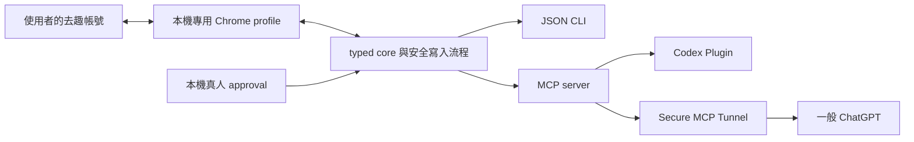

# chictrip-agent

`chictrip-agent` 是一個 local-first 的去趣 chicTrip 行程整合，提供 JSON CLI、
MCP server、Codex Skill／Plugin，以及供一般 ChatGPT 使用的 Secure MCP Tunnel
入口。它可以讀取與整理行程，也能在使用者於本機逐次批准後，建立或修改行程。

> [!WARNING]
> 這不是去趣官方 SDK。現行 provider adapter 使用去趣網頁前端在
> 2026-07-25 使用、但沒有公開文件保證的 endpoints。上游改版可能使功能失效；
> 正式多人、商業或公開上架前，應先取得去趣官方 API 與書面自動化授權。

## 功能與安全邊界

- 讀取自己擁有或共同編輯的行程，以及每天的完整景點。
- 搜尋去趣目的地與景點識別碼。
- 預覽建立或修改行程的完整 diff，不在 preview 階段修改去趣。
- 只有本機真人完成 `approve` 後，才允許一次 `apply` 寫入嘗試。
- 寫入預設關閉；新增景點還需要第二個獨立的實驗性旗標。
- 不支援跨日移動景點、刪除整趟行程、共編邀請、付款、訂房、保險或 eSIM。
- MCP 刻意沒有 approval tool，因此 agent 不能批准自己的變更。



## 支援矩陣

| 執行面 | 目前狀態 | 讀取 | 受控寫入 | 適用情境 |
| --- | --- | --- | --- | --- |
| JSON CLI | 可用 | 是 | 可明確啟用 | 開發、登入、人工批准、診斷 |
| 本機 stdio MCP | 可用 | 是 | 可繼承 shell 旗標 | MCP 開發與測試 |
| Codex personal Plugin | 可用 | 是 | 修改 personal deployment 後可用 | 日常 agent 工作流 |
| 一般 ChatGPT + Secure MCP Tunnel | 已驗證 | 是 | 目前發行入口固定唯讀 | 私人 Chat 讀取與規劃 |
| 公開 HTTPS MCP／Plugins Directory | 尚不可直接部署 | 否 | 否 | 需官方 API、OAuth 與架構改造 |

## 前置需求

- macOS；目前實際驗證環境為 Apple Silicon。
- [Bun](https://bun.sh/) 1.3 或更新版本。
- Node.js 22 或更新版本。
- Google Chrome。
- 使用一般 ChatGPT 時，另需 OpenAI
  [tunnel-client](https://github.com/openai/tunnel-client) 與可使用 Secure MCP
  Tunnel 的 OpenAI Platform／ChatGPT workspace。

## 安裝、建置與驗證

```bash
git clone git@github.com:knowlet/chictrip-agent.git
cd chictrip-agent
bun install --frozen-lockfile
bun run validate
```

`bun run validate` 會依序執行 TypeScript typecheck、62 項測試、bundle build，
再實際啟動建置後的 CLI。主要產物是：

- `dist/cli.mjs`
- `dist/http.mjs`
- `mcp/server.mjs`

`playwright-core` 不提交到 Git。Fresh clone 必須先執行 `bun install` 和 build／
validate，建置腳本才會把 runtime 依賴放進產物旁的 `node_modules`。

只驗證 Chat 專用 launcher 是否暴露八個工具且強制唯讀：

```bash
bun run smoke:chat-tunnel
```

這個 smoke 使用臨時 state；`authenticated:false` 是正常結果。它不代表已登入去趣，
也不代表 OpenAI Tunnel 已連線。

## 兩種登入不可混用

### 1. 登入去趣個人帳號

```bash
bun run cli -- auth login --timeout-ms 3600000
```

指令會開啟專用 Chrome profile。請在去趣官方頁面親自選擇平常使用的登入方式；
若該去趣帳號是用 Apple 建立，就選擇相同的 Apple 登入。不要把密碼、驗證碼、
Cookie 或 token 貼給 agent。

登入狀態預設保存在：

```text
~/.local/share/chictrip-agent/browser-profile
```

確認狀態與實際帳號：

```bash
bun run cli -- auth status
bun run cli -- capabilities
bun run cli -- trips list --scope all --limit 5
```

`auth status` 只顯示匿名的 `accountRefHash`，不顯示 email。請再從實際行程標題
確認這就是預期帳號。

目前沒有 `auth logout`。如果登入錯帳號，不要直接刪除不確定的 profile；改用新的
state directory 重新登入，並讓後續 CLI、MCP 與 Tunnel 全部使用同一個路徑：

```bash
export CHICTRIP_STATE_DIR="$HOME/.local/share/chictrip-agent-personal"
bun run cli -- auth login --timeout-ms 3600000
```

### 2. 登入 ChatGPT 與 OpenAI Platform

這是另一組登入，與去趣帳號無關。私人 owner deployment 目前使用同一個
**Sign in with Apple** 身分登入 ChatGPT 與 OpenAI Platform。建立 Tunnel 前請確認：

1. [ChatGPT](https://chatgpt.com/) 顯示的是預期個人帳號與方案。
2. [OpenAI Platform Tunnel settings](https://platform.openai.com/settings/organization/tunnels)
   也使用預期 Platform organization。
3. Tunnel 有關聯到真正要使用的 ChatGPT workspace，而不只是 Platform
   organization。

不要把 OpenAI API key、Tunnel runtime key、Apple 密碼或 MFA code 放進 issue、
README、Git、shell history 或 agent 對話。

## JSON CLI 使用方式

所有命令在 stdout 只輸出一個 JSON document；診斷與人工確認提示寫到 stderr。

```bash
bun run cli -- capabilities
bun run cli -- trips list --scope all --limit 100
bun run cli -- trips get <TRIP_ID>
bun run cli -- destinations search --query 東京 --limit 10
bun run cli -- places search --query 東京車站 --limit 10
bun run cli -- changes preview --input examples/create-trip-intent.json
bun run cli -- changes status <OPERATION_ID_OR_IDEMPOTENCY_KEY>
```

完整 help：

```bash
bun run cli -- help
```

如果希望使用全域 `chictrip` 指令，可在 build 後建立 launcher。若目標已存在，
先檢查它，不要直接覆寫：

```bash
mkdir -p "$HOME/.local/bin"
ln -s "$PWD/dist/cli.mjs" "$HOME/.local/bin/chictrip"
```

沒有安裝 launcher 時，README 中所有 `chictrip ...` 都可改成
`bun run cli -- ...`。

## MCP 工具

| 工具 | 作用 | Provider 寫入 |
| --- | --- | --- |
| `chictrip_capabilities` | 顯示登入與實際能力 | 否 |
| `chictrip_list_trips` | 列出行程 | 否 |
| `chictrip_get_trip` | 讀取完整行程 | 否 |
| `chictrip_search_places` | 搜尋景點 | 否 |
| `chictrip_search_destinations` | 搜尋目的地 | 否 |
| `chictrip_preview_trip_change` | 建立 diff 與 execution plan | 否 |
| `chictrip_apply_trip_change` | 執行已預覽且本機批准的變更 | 是 |
| `chictrip_get_change_status` | 讀取本機 idempotency ledger | 否 |

工具清單會包含 apply，不代表寫入已開啟；永遠以 `chictrip_capabilities` 回傳的
write capabilities 為準。

## 啟用寫入權限

### 寫入層級

| `CHICTRIP_ENABLE_UNDOCUMENTED_WRITES` | `CHICTRIP_ENABLE_EXPERIMENTAL_ITEM_ADDS` | 能力 |
| --- | --- | --- |
| `0` | `0` | 完全唯讀 |
| `1` | `0` | 建立空行程、修改行程欄位、修改／刪除既有景點、同日排序 |
| `1` | `1` | 再加入新增景點；仍屬實驗性 |

第二個旗標單獨設為 `1` 沒有效果。任何層級都不支援跨日移動或刪除整趟行程。
即使兩個旗標都是 `1`，新增景點仍必須先搜尋真實
`providerPlaceId`，不能自行捏造；item note 新增／修改與改變行程總天數
目前也會被阻擋。

### CLI 或直接啟動的本機 MCP

只在隔離的 `owned` 測試行程開始，第一次保持 item add 關閉：

```bash
export CHICTRIP_ENABLE_UNDOCUMENTED_WRITES=1
export CHICTRIP_ENABLE_EXPERIMENTAL_ITEM_ADDS=0

bun run cli -- capabilities
```

直接執行的 `bun run cli --`、`bun run mcp:stdio` 與 `bun run mcp:http` 會繼承
同一個 shell 的旗標。`.env.example` 只是參考檔；變數必須真的由 shell 或 process
manager 注入。不要提交包含秘密或寫入設定的 `.env`。

完成測試後關閉旗標並重啟所有相關 process：

```bash
unset CHICTRIP_ENABLE_UNDOCUMENTED_WRITES
unset CHICTRIP_ENABLE_EXPERIMENTAL_ITEM_ADDS
bun run cli -- capabilities
```

### Codex personal Plugin

Repository 的 [`.mcp.json`](.mcp.json) 明確把兩個旗標固定為 `0`，因此外層
shell 的 `export` 不會開啟已安裝 Plugin。要啟用受控寫入：

1. 只修改 personal marketplace 指向的 canonical source，例如
   `~/plugins/chictrip-agent/.mcp.json`。
2. 將 `CHICTRIP_ENABLE_UNDOCUMENTED_WRITES` 改成 `1`，第一次仍讓
   `CHICTRIP_ENABLE_EXPERIMENTAL_ITEM_ADDS` 保持 `0`。
3. 使用內建 `$plugin-creator` 更新 cachebuster、執行 Plugin validator 並重裝。
4. 開啟新的 Codex task；既有 task 不會重新載入 Plugin。
5. 先呼叫 `chictrip_capabilities` 確認實際能力，再做 preview。

已經設定好 personal marketplace 的 owner deployment 可執行：

```bash
python3 "$HOME/.codex/skills/.system/plugin-creator/scripts/update_plugin_cachebuster.py" \
  "$HOME/plugins/chictrip-agent"

codex plugin add chictrip-agent@personal --json
codex plugin list --json
```

不要手改 `~/.agents/plugins/marketplace.json`，也不要直接修改
`~/.codex/plugins/cache/...`。第一次建立 personal marketplace entry 時，請在 Codex
使用 `$plugin-creator`，指定目前 clone 的路徑與 `chictrip-agent` 名稱。

### 一般 ChatGPT

[`scripts/run-chat-tunnel-mcp.sh`](scripts/run-chat-tunnel-mcp.sh) 會強制把兩個
旗標都覆寫成 `0`。因此目前一般 Chat 發行入口是**確定唯讀**；在外層 export
旗標也無法開啟寫入。

若未來要在 Chat 測試寫入，必須新增另一個明確的 writable launcher、另一個
runtime profile／alias，並先保持 item add 關閉。不要修改或重用唯讀 launcher。
ChatGPT 方案與 workspace policy 也可能限制 write tools；以該 workspace 的實際
能力為準。即使 Chat 能呼叫 apply，仍不能取得或代替本機人工 approval。

## `preview → approve → apply`

Preview 不會修改去趣，但會將完整 execution plan 寫入本機 state，有效 15 分鐘：

```bash
bun run cli -- changes preview --input <INTENT_JSON>
```

檢查完整 diff、warnings、blockers、write count 與目標 `owned` 行程後，使用者必須
在互動式本機終端執行：

```bash
bun run cli -- changes approve <PREVIEW_UUID>
```

接著親自輸入畫面要求的精確字串 `APPLY <reviewCode>`。Approval grant 有效
5 分鐘、一次性消耗，沒有 `--yes` 或 `--force`；approval secret 不會進入 argv、
stdout 或 MCP。

最後使用 preview 回傳的 `intentHash` 與新的 UUID 執行：

```bash
bun run cli -- changes apply \
  --preview-id <PREVIEW_UUID> \
  --intent-hash <INTENT_HASH> \
  --idempotency-key <FRESH_UUID>
```

Apply 會綁定 preview、execution plan、去趣帳號與 transport，並在寫入前重新檢查
revision。若結果是 `conflict`、`partial`、`indeterminate` 或 `failed`，不要換一個
UUID 盲目重試。

`changes status`／`chictrip_get_change_status` 只讀取本機 ledger，不會向去趣查詢。
需要確認 provider 現況時，另外執行：

```bash
bun run cli -- trips get <TRIP_ID>
```

## 本機 MCP

### stdio

Source：

```bash
bun run mcp:stdio
```

建置後：

```bash
node mcp/server.mjs
```

### Loopback Streamable HTTP

```bash
export CHICTRIP_MCP_BEARER_TOKEN="$(openssl rand -hex 32)"
bun run mcp:http
```

Endpoint 是 `http://127.0.0.1:3333/mcp`。程式只允許 loopback host、只接受
JSON MCP request、拒絕瀏覽器 `Origin`，並要求 bearer token。沒有設定 token 時，
process 會建立短效隨機值並只在 stderr 顯示一次。

這個 HTTP server 刻意不能綁定公網，不能直接當作正式遠端部署。

## 部署到 Codex Plugin

這個 repository 本身就是 Plugin source：

```text
.codex-plugin/plugin.json
.app.json
.mcp.json
skills/chictrip-itinerary/
mcp/server.mjs
```

`.app.json` 目前綁定 owner-specific 的私人 Developer App。App ID 不是 runtime
secret，但屬於特定 OpenAI account／workspace；其他部署者必須建立自己的 App 並
替換該 ID。

建議把 clone 放在 `~/plugins/chictrip-agent`，build 完成後使用 `$plugin-creator`
建立 personal marketplace entry，再安裝：

```bash
codex plugin add chictrip-agent@personal --json
codex plugin list --json
```

安裝或更新後必須開新 task，才會載入新版 Skill、MCP 與 App mapping。可用自然語言
要求「只使用 chictrip-agent 列出我的去趣行程」，或明確使用已安裝的
`chictrip-agent:chictrip-itinerary` Skill。

## 部署到一般 ChatGPT：Secure MCP Tunnel

官方 [Secure MCP Tunnel](https://developers.openai.com/api/docs/guides/secure-mcp-tunnels)
讓 ChatGPT 透過 outbound HTTPS 使用本機 stdio MCP，而不必把 server 暴露在公網。
本機 Mac、Chrome 登入 profile 與 tunnel-client runtime 必須保持運行。

### 1. 先驗證本機 read-only launcher

```bash
bun run validate
bun run cli -- auth status
bun run smoke:chat-tunnel
```

不要把 `run-chat-tunnel-mcp.sh` 單獨當作 Tunnel 啟動命令；它只是
`tunnel-client` 要管理的 stdio child process。

### 2. 建立 Tunnel 與 runtime key

1. 使用正確的 Apple／OpenAI 身分登入
   [Platform Tunnel settings](https://platform.openai.com/settings/organization/tunnels)。
2. 建立 Tunnel，並關聯目標 ChatGPT workspace。
3. 建立只具 `Tunnels: Read + Use` 的 Runtime API key。
4. 在 Platform 按 Copy 後，於本機執行以下腳本；不要把 key 貼進終端參數或對話：

```bash
./scripts/store-chat-tunnel-key-from-clipboard.sh
```

腳本會把 key 原子寫入：

```text
~/.local/share/chictrip-agent/openai-tunnel-runtime-key
```

目錄／檔案 mode 分別為 `0700`／`0600`，成功後會清空系統剪貼簿。

### 3. 啟動受管理的 runtime

把 placeholder 換成自己的 Tunnel ID：

```bash
tunnel-client runtimes connect \
  --alias chictrip-chat \
  --profile chictrip-chat-readonly \
  --profile-dir "$PWD/.tunnel-client/profiles" \
  --tunnel-id <YOUR_TUNNEL_ID> \
  --runtime-api-key "file:$HOME/.local/share/chictrip-agent/openai-tunnel-runtime-key" \
  --mcp-command "$PWD/scripts/run-chat-tunnel-mcp.sh" \
  --json
```

`.tunnel-client/` 是機器專屬設定，已被 Git 忽略。

檢查 profile 與 runtime：

```bash
tunnel-client doctor \
  --profile chictrip-chat-readonly \
  --profile-dir "$PWD/.tunnel-client/profiles" \
  --explain

tunnel-client runtimes status chictrip-chat --json
```

只有 `process_running`、`healthy`、`ready` 都是 `true` 才算上線。

停止 runtime：

```bash
tunnel-client runtimes stop chictrip-chat --json
```

### 4. 在 ChatGPT 建立 Developer mode App

依官方 [Connect from ChatGPT](https://developers.openai.com/api/docs/guides/secure-mcp-tunnels#connect-from-chatgpt)：

1. 在 ChatGPT **Settings → Security and login** 開啟 **Developer mode**。
2. 前往 [ChatGPT Plugins](https://chatgpt.com/plugins)，按加號建立 App。
3. Connection 選擇 **Tunnel**，選取可見的 Tunnel 或貼上 Tunnel ID。
4. 若看不到 Tunnel，檢查 workspace association，以及建立者是否有
   `Tunnels: Read + Use`。
5. 建立後更新 `.app.json` 的 App ID，再透過 `$plugin-creator` 重裝 Plugin。
6. 開新 Chat，從工具選單連接 App。

建議 E2E smoke prompt：

```text
只使用「去趣行程助理」工具，不使用聊天記憶。
先呼叫 chictrip_capabilities，確認所有 provider write capability 都是 false；
再呼叫 chictrip_list_trips，scope=all、limit=5，列出標題、日期、ownership 與 trip ID。
不要呼叫 preview 或 apply。
```

## 正式遠端部署

目前程式**不能原封不動部署成公開、多使用者的遠端 MCP**，原因包括：

- `mcp:http` 強制只綁 loopback。
- Provider authentication 依賴單一使用者本機 Chrome profile。
- 人工 approval 依賴同一台機器的互動式 CLI。
- 去趣 endpoints 未公開，沒有穩定版本契約或正式 OAuth scopes。

正式版本至少需要：

1. 去趣官方 partner API 與書面自動化授權。
2. 每位使用者自己的 OAuth 2.1 authorization-code + PKCE 流程。
3. 公開、穩定、production HTTPS Streamable HTTP endpoint，通常為 `/mcp`。
4. Server-side authorization、tenant isolation、rate limiting、secret management。
5. Logs／metrics／tracing 不記錄 token 或敏感行程內容。
6. 可回復部署、版本化 MCP metadata 與 backward-compatible tool schemas。
7. 將 local approval 重新設計成伺服器端、agent 無法自行核准的確認流程。

OpenAI 官方要求公開 submission 不得使用 temporary tunnel 或 local endpoint；詳見
[Deploy the endpoint](https://developers.openai.com/plugins/build/mcp-server#deploy-the-endpoint)。

## 公開 Plugins Directory

ChatGPT 與 Codex 共用 Universal Plugins Directory。公開流程是提交、審查、核准後
由發布者再按 Publish；詳見
[Public publishing flow](https://developers.openai.com/plugins/deploy/submission#public-publishing-flow)。

本專案目前不適合送審。除了上述正式 MCP 與官方去趣授權之外，還需要：

- 已驗證的發布者與 `Apps Management: Write` 權限。
- 可驗證的 MCP 網域。
- Website、support、privacy policy 與 terms。
- 清楚的 tool annotations、auth scopes、錯誤與確認行為。
- Reviewer 可直接使用且不要求 MFA 的 demo account／sample data。
- 五個 positive tests 與三個 negative tests。
- 先取得去趣同意此第三方 connector 的正式授權。

Secure MCP Tunnel 適合私人、本機或內網服務，不等同公開 production deployment。

## 資料與安全

- Runtime key、state、approval secret、preview、ledger 與瀏覽器 profile 不應進 Git。
- 本工具建立的 state／approval 檔案使用 `0600`；browser profile 位於 `0700`
  目錄內，內部檔案 mode 由 Chrome 管理。
- 每次 provider request 都在同一個 browser page 內取得固定認證 tuple，並驗證
  JWT `sub` 與 `memberId` 一致；token 不離開 page context。
- Approval 綁定完整 execution plan、帳號與 transport，短效且一次性消耗。
- Apply 前重讀 revision；不一致就停止，不能 force。
- Provider 回應缺 revision、回讀不完整或結果不唯一時，回報
  `partial`／`indeterminate`，不宣稱成功。
- `.tunnel-client/`、`.env`、browser profile、state、log 與 runtime key 都在
  `.gitignore` 內；push 前仍應執行 secret scan。

Provider allowlist 與 revision 契約在
[`docs/provider-api-notes.md`](docs/provider-api-notes.md)，架構決策在
[`docs/architecture-decision.md`](docs/architecture-decision.md)。

## 疑難排解

### `AUTH_REQUIRED`

先在本機執行 `bun run cli -- auth login`，再以 `trips list` 驗證實際帳號。CLI、
MCP 與 Tunnel 必須使用相同的 `CHICTRIP_STATE_DIR`。

### 登入到錯誤帳號

目前沒有 logout。建立新的 `CHICTRIP_STATE_DIR`，重新登入並用真實行程確認；不要在
不知道內容時刪除既有 browser profile。

### 外層 export 了寫入旗標，但 Plugin 仍唯讀

這是預期行為。`.mcp.json` 與 Chat read-only launcher 都會覆寫外層環境。修改
personal canonical source、cachebuster、重裝、開新 task，再看 capabilities。

### Tunnel 在 ChatGPT 看不到

確認 runtime `healthy`／`ready`、Tunnel 關聯正確 ChatGPT workspace，以及 App 建立者
有 `Tunnels: Read + Use`。

### `partial` 或 `indeterminate`

不要重新產生 UUID 重試。先用 `changes status` 看本機 ledger，再用 `trips get`
讀取 provider 現況，最後由人決定是否建立全新的 preview。

## 開發命令

```bash
bun run check
bun test
bun run build
bun run validate
bun run smoke:chat-tunnel
```

每次變更 tool schema、annotations、auth 或 App mapping 後，都應重新執行 Plugin
validator、更新 cachebuster、重裝並在新 conversation 重跑正向／負向 smoke。
